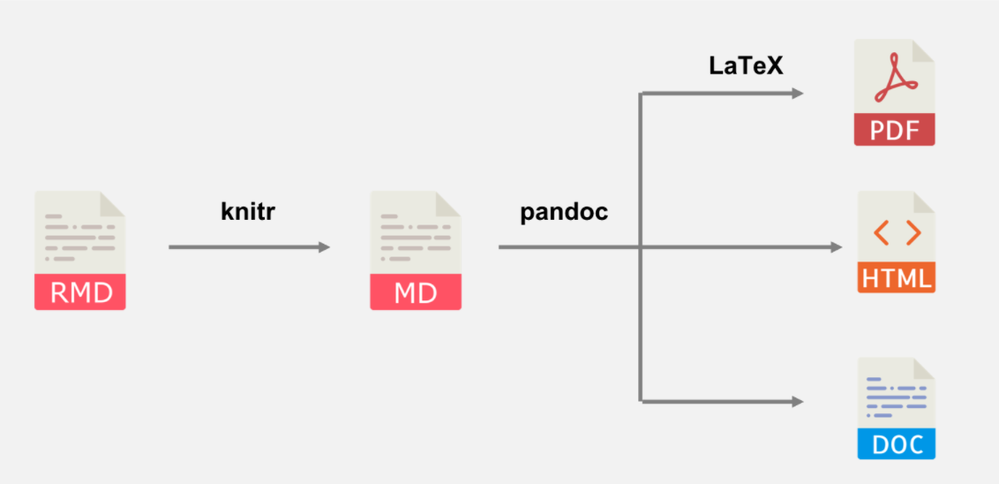
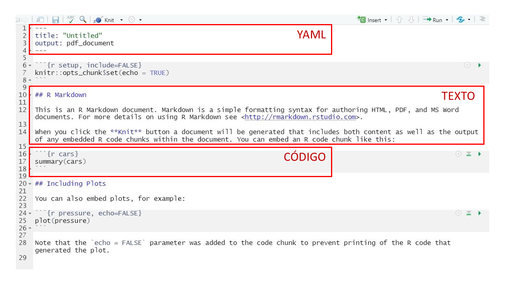
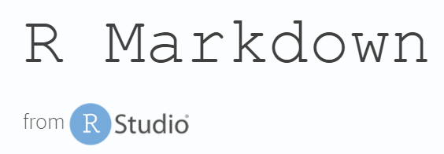
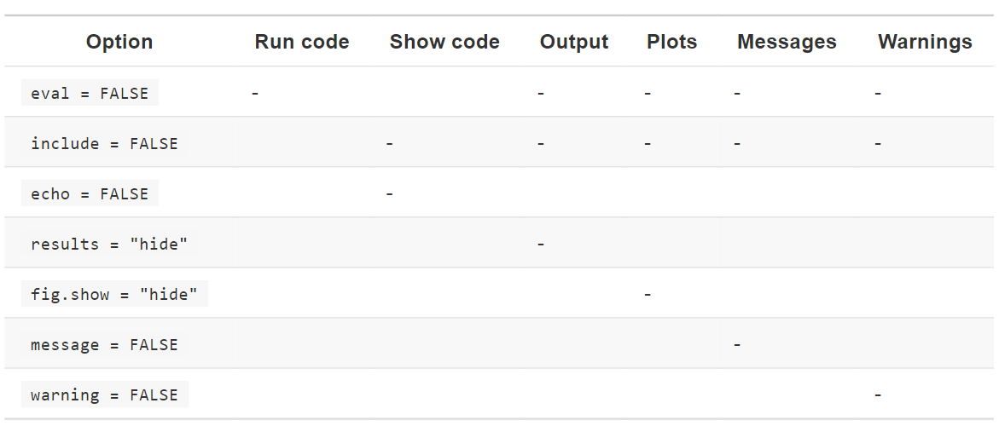
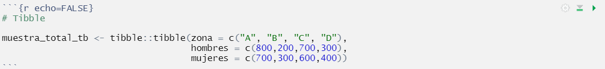

```{r setup, include=FALSE}
knitr::opts_chunk$set(echo = TRUE, warning = FALSE, message = FALSE)
```

# ¿Qué es R Markdown?

Un framework para crear documentos y presentaciones, integrando texto, código y resultados. Se pueden crear documentos en html, pdf o word usando código en R.

Además, existen paquetes como `flexdashboard` que permiten extender el uso de R Markdown para la construcción de dashboards.

En estas notas se revisarán dos formatos de documentos (pdf y word) y dos de presentaciones (beamer y power point).

# Ventajas de R Markdown

- Facilita la colaboración
- Permite replicar el trabajo realizado por otras personas
- Se puede automatizar la generación de informes

# Flujo de un documento



En resumen,

`rmarkdown::render() = knitr::knit() + Pandoc (+ LaTeX sólo para PDF output)`


# Componentes de un documento en R Markdown

A continuación se presenta un ejemplo de un documento en R Markdown donde pueden visualizarse sus componentes:




# YAML 

YAML significa **Y**et **A**nother **M**arkup **L**anguage.

En este se especifica el `output`, entre los cuales se cuentan:


- `pdf_document`: crea un PDF con LaTex, el cual deberás instalarlo.

- `word_document`: crea un documento en Word (.docx)

- `beamer_presentation`: presentación en PDF con LaTeX Beamer.

- `powerpoint_presentation`

Cada uno de estos outputs permite un conjunto de opciones, las cuales pueden visualizarse con:

- `?rmarkdown::pdf_document`

- `?rmarkdown::word_document`

- `?rmarkdown::beamer_presentation`

- `?rmarkdown::powerpoint_presentation`

Además del `output` se puede especificar el nombre del autor del documento o presentación, fecha, tamaño de letra, etc.

# Texto


## Formato de texto 

```{r eval = FALSE}
*RMarkdown*  o _RMarkdown_

**RMarkdown** o __RMarkdown__

`code`

superíndice^2^ y subíndice~2~
```

El resultado es el siguiente:

*RMarkdown*  o _RMarkdown_

**RMarkdown** o __RMarkdown__

`code`

superíndice^2^ y subíndice~2~


## Encabezados

```{r eval = FALSE}

# Primer nivel

## Segundo nivel

### Tercer nivel

```

El resultado es el siguiente:

# Primer nivel {-}
## Segundo nivel {-}
### Tercer nivel {-}

## Listas

```{r eval = FALSE}
* Parte 1
* Parte 2

1. Parte 1
2. Parte 2
```

El resultado es el siguiente:

* Parte 1
* Parte 2

1. Parte 1
2. Parte 2

## Links

```{r eval = FALSE}
[World Development Indicators](http://datatopics.worldbank.org/world-development-indicators/)

<http://datatopics.worldbank.org/world-development-indicators/>
```

El resultado es el siguiente:

[World Development Indicators](http://datatopics.worldbank.org/world-development-indicators/)

<http://datatopics.worldbank.org/world-development-indicators/>

## Imágenes

```{r eval = FALSE}

```

El resultado es el siguiente:


## Tablas

```{r eval=FALSE}
Encabezado 1  | Encabezado 2
------------- | -------------
Contenido     | Contenido   
Contenido     | Contenido   
```

El resultado es el siguiente:

Encabezado 1  | Encabezado 2
------------- | -------------
Contenido     | Contenido   
Contenido     | Contenido   

## Expresiones matemáticas

```{r eval = FALSE}
$\overline x = \frac{\sum_{i=1}^n x_i}{n}$
$$\overline x = \frac{\sum_{i=1}^n x_i}{n}$$
```

El resultado es el siguiente:

$\overline x = \frac{\sum_{i=1}^n x_i}{n}$
$$\overline x = \frac{\sum_{i=1}^n x_i}{n}$$


## Saltos de página e insertar slide en una presentación

Para insertar un salto de página `\newpage`

En el caso de presentaciones una *nueva slide* puede agregarse con `#` o `##`.

## Sangría

```{r eval=FALSE}
| Para insertar sangría
|    Para insertar sangría
```

El resultado es el siguiente:

| Para insertar sangría
|    Para insertar sangría

# Código

## ¿Cómo insertar código? 

- Cmd/Ctrl + Alt + I
- Usar el ícono del botón "Insert" en la barra de herramientas del editor.
- Escribir los delimitadores del trozo de código

`` `r "\u0060\u0060\u0060{r}   código  \u0060\u0060\u0060"` ``

## Opciones

Entre las opciones que se disponen para controlar el resultado de correr un código se encuentran:



Por ejemplo, el siguiente código crea un *tibble*, pero no se muestra el código en el documento o presentación generada.



## Tabla

Para mostrar el *tibble* creado anteriormente como una tabla:


```{r echo = FALSE}
library(dplyr)
```


```{r echo=FALSE}
# Tibble

muestra_total_tb <- tibble::tibble(zona = c("A", "B", "C", "D"),
                           hombres = c(800,200,700,300),
                           mujeres = c(700,300,600,400)
                           )
```

```{r }
muestra_total_tb %>% knitr::kable()
```

Existen distintas opciones para afectar el formato de la tabla, las cuales pueden revisarse escribiendo en la console `?knitr::kable`

## Código inline

Se puede incorporar código directamente en el texto escribiendo `` `r "\u0060r \u0060"` ``.
Por ejemplo, si se escribe: *El número de filas del tibble es `` `r "\u0060r nrow(muestra_total_tb)\u0060"` ``*, se obtiene:

> El número de filas del tibble es `r nrow(muestra_total_tb)`


# Recursos para el aprendizaje

En RStudio se puede acceder a Cheatsheets relacionadas a RMarkdown:

- R Markdown Cheat Sheet: *Help > Cheatsheets > R Markdown Cheat Sheet*

- R Markdown Reference Guide: *Help > Cheatsheets > R Markdown Reference Guide*

Además, se recomienda revisar <http://rmarkdown.rstudio.com> y el libro *R Markdown: The Definitive Guide* que se puede encontrar en  <https://bookdown.org/yihui/rmarkdown/>.

