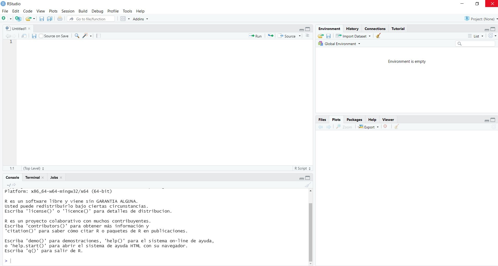
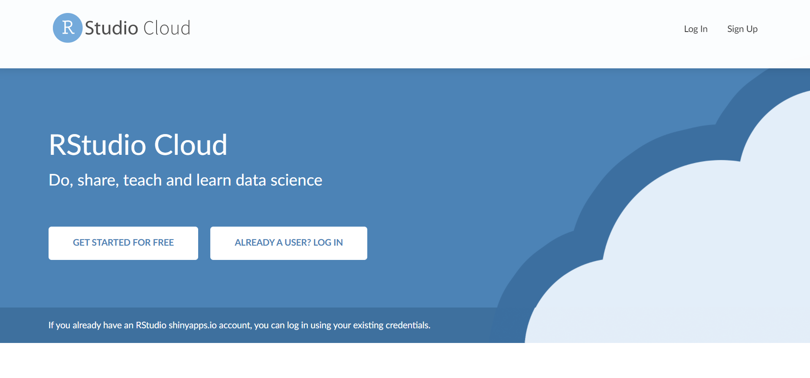

```{r setup, include=FALSE}
knitr::opts_chunk$set(echo = TRUE)
```

# ¿Cómo instalar R y RStudio en tu computador?

Para comenzar a trabajar en R debes instalar R y RStudio siguiendo los siguientes pasos:

## Paso 1

Ir a la página <http://www.r-project.org> y seguir las instrucciones, dependiendo del sistema operativo de tu computador (Linux, Mac o Windows).

-   Si tu sistema operativo es Windows, ver el siguiente video:
<https://youtu.be/mfGFv-iB724>
-   Si tu sistema operativo es de Mac, ver el siguiente video: <https://youtu.be/Icawuhf0Yqo>

## Paso 2

Una vez instalado R, se recomienda instalar RStudio que constituye un Integrated Development Environment (IDE) y provee de una interface para trabajar en R.

Ir a la siguiente página: <http://www.rstudio.com> y seguir las instrucciones, de acuerdo al sistema operativo de tu computador.

## Paso 3

Abre RStudio y comienza a trabajar en R!



# RStudio Cloud

Otra forma de trabajar con R es usar RStudio Cloud que es la versión en la nube de RStudio. Para comenzar a trabajar de esta forma, se debe crear una cuenta en <https://rstudio.cloud/> y luego generar un nuevo proyecto.




# Instalación de paquetes

Gran parte de la funcionalidad de R proviene de paquetes, los que consisten de conjuntos de funciones y objetos que son escritos por miembros de la comunidad de R. Así, por ejemplo, hay paquetes que permiten construir gráficos como `ggplot2` y otros que permiten importar datos en formato Stata (.dta), como es el caso del paquete `haven`.

Para la instalación de paquetes escriba en la console de RStudio el siguiente comando y nombre del paquete en el espacio entre paréntesis:

```{r eval = FALSE}
install.packages(" ")
```

Una vez instalalado el paquete, llame el paquete desde el script, escribiendo su nombre en el espacio entre paréntesis y, de esta manera, estará disponible en su sesión actual de R:

```{r eval = FALSE}
library( )
```


Es importante recordar que se debe instalar el paquete una vez, pero se debe llamar con `library` cada vez que se desee usarlo en una sesión de R.

# Repositorios de paquetes

Los principales repositorios de paquetes son:

-   CRAN (Comprehensive R Archive Network) <https://cran.r-project.org/web/packages/>
-   GitHub <https://github.com/>
-   Bioconductor <http://www.bioconductor.org/>

Para ver una lista de paquetes disponibles por tópico en CRAN se recomienda revisar: <https://cran.r-project.org/web/views/>

# Chequear versión de R

Para chequear la versión de R instalada en tu computador, escribe en la consola:

```{r}
R.version.string
```


# Ayuda

-   Para obtener ayuda acerca de una función en particular, escriba en la consola el símbolo `?` seguido por el nombre de la función. Por ejemplo, `?sqrt`
-   R-help - Main R Mailing List <https://stat.ethz.ch/mailman/listinfo/r-help>
-   Stack Overflow. En Twitter ver @StackOverflow o <https://stackoverflow.com/>
-   RStudio Community <https://community.rstudio.com/>

# Textos de referencia

Wickham, H. 2020. ggplot2: elegant graphics for data analysis. <https://ggplot2-book.org/>

Wickham, H. y G. Grolemund. 2020. R for data science. <https://r4ds.had.co.nz/>

Xie, Y., Allaire, J.J. y G. Grolemund. 2020. R Markdown: The definitive guide. <https://bookdown.org/yihui/rmarkdown/>

# Otros recursos para el aprendizaje

R y RStudio cuentan con una amplia comunidad, por lo que existen muchos recursos a los que se puede acceder de forma gratuita. Además de existir numerosos cursos online, se recomienda revisar:

-   RStudio cheat sheets <https://www.rstudio.com/resources/cheatsheets/>
-   R Bloggers <https://www.r-bloggers.com/>
-   En Twitter tweets relacionados con R tienen el hashtag \#rstats
-   Lista de libros relacionados a R <https://www.r-project.org/doc/bib/R-books.html>
-   R Journal <https://journal.r-project.org/>

